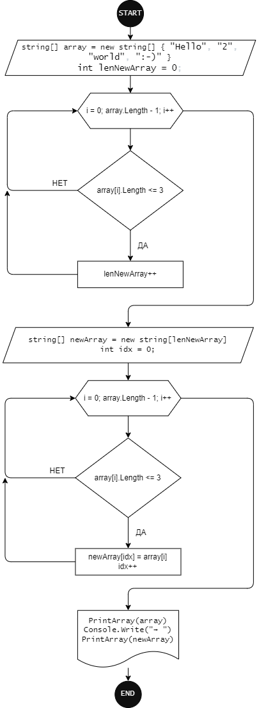

### ОПИСАНИЕ РЕШЕНИЯ ### 
Для удобства проверки разных массивов в программ использован switch, функции ввода/вывода в консоль.
Они не указаны в блок-схеме.

Процедура array — ввод данных в массив.
Процедура printA — вывод на экран значений массива.

### написана программа, решающая предложенную задачу ###

Console.Write("Введите количество элементов массива: ");
int m = Convert.ToInt32(Console.ReadLine());
string [] stringArray = new string [m];
void array(string [] stringArray)
{
  for (int i = 0;i<stringArray.Length;i++)
  {
     Console.WriteLine($"Введите {i+1} элемент массива");
     stringArray[i] = Console.ReadLine();
  }
}
string [] symbol(string [] stringArray)
{
  int n = 0;
  for (int i = 0;i<stringArray.Length;i++)
  {
    if(stringArray[i].Length <=3)
    n++;
  }
  string [] rez = new string [n];
  int j = 0;
  for (int i = 0;i<stringArray.Length;i++)
  {
    if(stringArray[i].Length <=3)
    {
        rez[j] = stringArray[i];
        j++;
    }
  }
  return rez;
}
void printA(string [] stringArray)
{
    Console.Write("");
    for (int i = 0;i<stringArray.Length;i++)
    {
    Console.Write($"‘{stringArray[i]}’, ");
    }
    Console.Write("");
}
array(stringArray);
printA(symbol(stringArray));
